<div align="center">
  <br />
  
  <br />
  <h2>🥂부담없이 편하게, 취향이 비슷한 술 친구를 찾는 서비스🍸</h2>
<h3>삼성 청년 소프트웨어 아카데미 공통 프로젝트 우수상 수상🥈</h3>

<b>[ SSAFY 10기 공통 PJT ] </b>

<br />

</div>

## 목차

1. [**웹 서비스 소개**](#1)
1. [**기술 스택**](#2)
1. [**주요 기능**](#3)
1. [**프로젝트 구성도**](#4)
1. [**서비스 화면**](#5)
1. [**개발 팀 소개**](#6)
1. [**개발 기간 및 일정**](#7)
1. [**디렉터리 구조**](#8)
1. [**산출물**](#9)

<br />

<div id="1"></div>

## ✨ 웹 서비스 소개

너, 내 술 친구가 돼라!🐨 <br/>
코알라 메이트에서는 자신의 냉장고를 꾸미고, 레시피를 공유하며 술 취향을 표현할 수 있습니다. <br/>
지도에서 친구의 냉장고를 찾고, 실시간 음성채팅을 통해 편하게 술 친구를 만들 수 있습니다. <br/>

### [코알라 메이트 바로 가기](https://i10d212.p.ssafy.io/) (서비스 종료)
### [홍보 UCC 보러가기](https://drive.google.com/file/d/1FQIJq7BOLxO1kvShqeOAnim6OIfaA4Pc/view?usp=sharing)

<br />

<div id="2"></div>

## 🛠️ 기술 스택

### Frontend
        

### Backend
       

### DevOps
   

### Tools
    

<br />

<div id="3"></div>

## 💡 주요 기능

<table style="word-break: keep-all;">
<tr ><th style="text-align:center;">기능</th><th>내용</th></tr>
<tr>
  <td style="text-align:center;">메이트 찾기</td>
  <td>위치 기반 서비스를 통해 내 위치와 가까운 메이트의 냉장고부터 지도에서 볼 수 있습니다.</td>
</tr>

<tr>
  <td style="text-align:center;">냉장고 꾸미기</td>
  <td>냉장고의 외부는 MBTI 뱃지로, 내부는 카테고리 별로 술병을 배치하며 냉장고를 꾸밉니다. </td>
</tr>

<tr>
  <td style="text-align:center;">실시간 채팅</td>
  <td>서비스의 어떤 페이지에서든 실시간 텍스트, 음성 채팅을 이용할 수 있습니다.</td>
</tr>

<tr>
  <td style="text-align:center;">칵테일 레시피 공유</td>
  <td>엄선된 레시피를 즐기거나, 나만의 레시피를 다른 사용자들과 공유하고 좋아요/팔로우를 등록합니다.</td>
</tr>
</table>

<br/>

<div id="4"></div>

## 📂 프로젝트 구성도
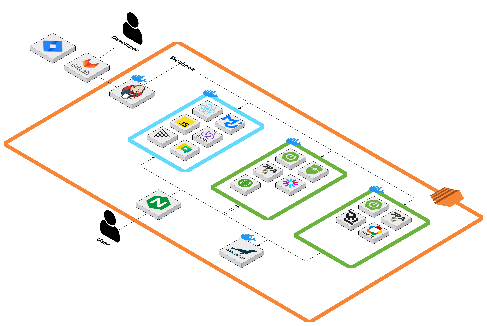

<br/>
<br/>

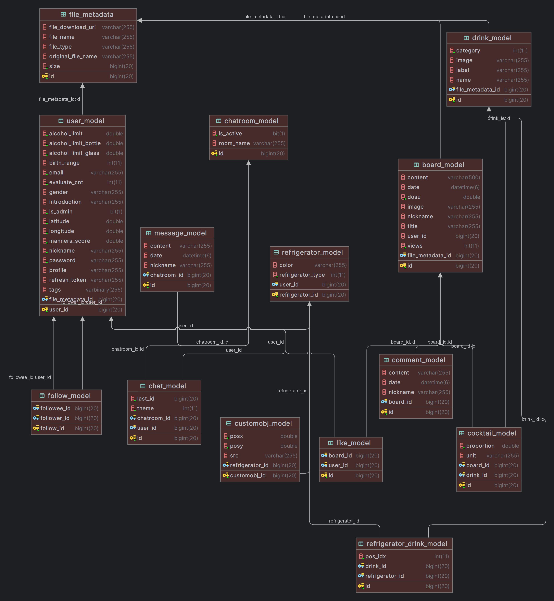

<br/>

<div id="5"></div>

## 🖥️ 서비스 화면

### 메인화면
<table style="border: 2px; text-align:center;">
  <tr style="text-align:center;">
    <td> 메인화면 </td>
  </tr>
  <tr>
    <td>
     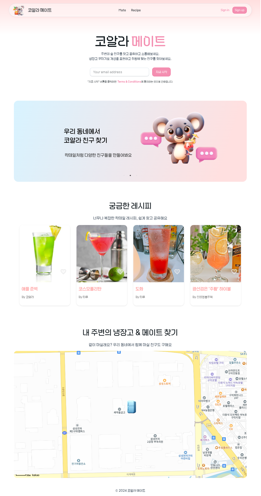
    </td>
  </tr>
</table>

<br/>

### 코알라 메이트 찾기
<table style="border: 2px; text-align:center;">
  <tr style="text-align:center;">
    <td> 내 주변의 냉장고 </td>
    <td> 메이트의 프로필 </td>
  </tr>
  <tr>
    <td>
      
    </td>
    <td>
      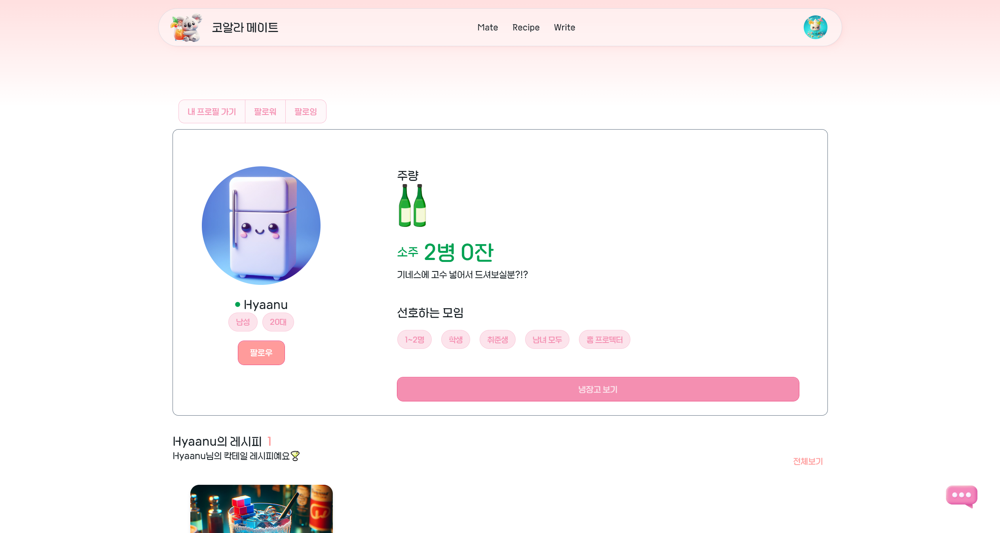
    </td>
  </tr>
</table>
<table style="border: 2px; text-align:center;">
  <tr style="text-align:center;">
    <td> 메이트의 팔로워</td>
    <td> 메이트의 팔로잉 </td>
  </tr>
  <tr>
    <td>
      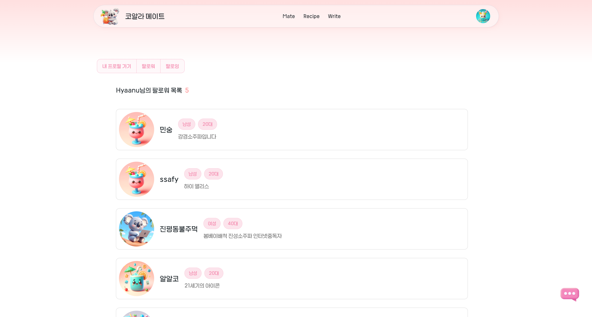
    </td>
    <td>
      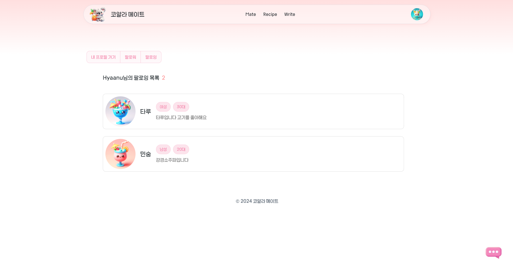
    </td>
  </tr>
</table>

<br/>

### 나만의 냉장고 꾸미기
<table style="border: 2px; text-align:center;">
  <tr style="text-align:center;">
    <td> 냉장고 외부 </td>
    <td> 냉장고 내부1 </td>
    <td> 냉장고 내부2 </td>
  </tr>
  <tr>
    <td>
      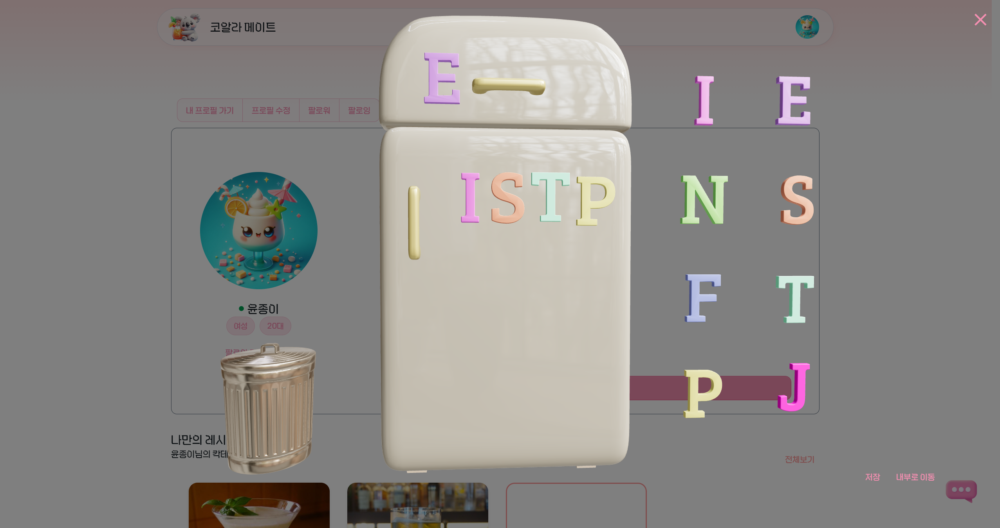
    </td>
    <td>
      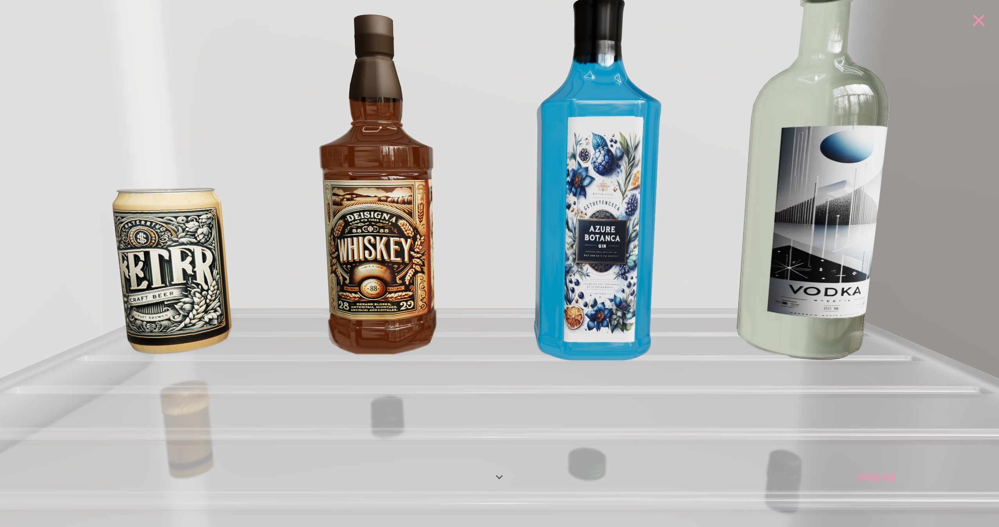
    </td>
    <td>
      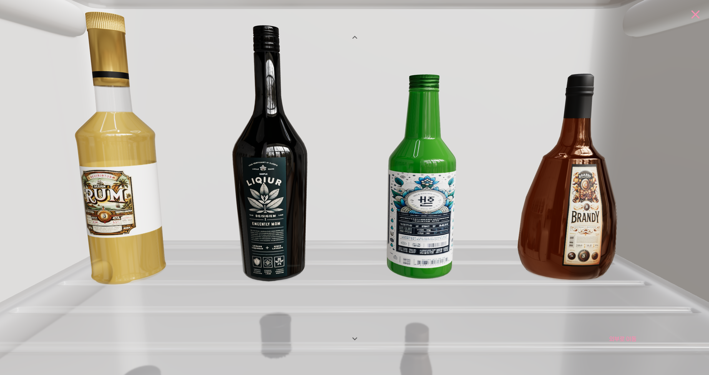
    </td>
  </tr>
</table>

<br/>

### 실시간 채팅
<table style="border: 2px; text-align:center;">
  <tr style="text-align:center;">
    <td> 채팅방, 대화목록 </td>
  </tr>
  <tr>
    <td>
      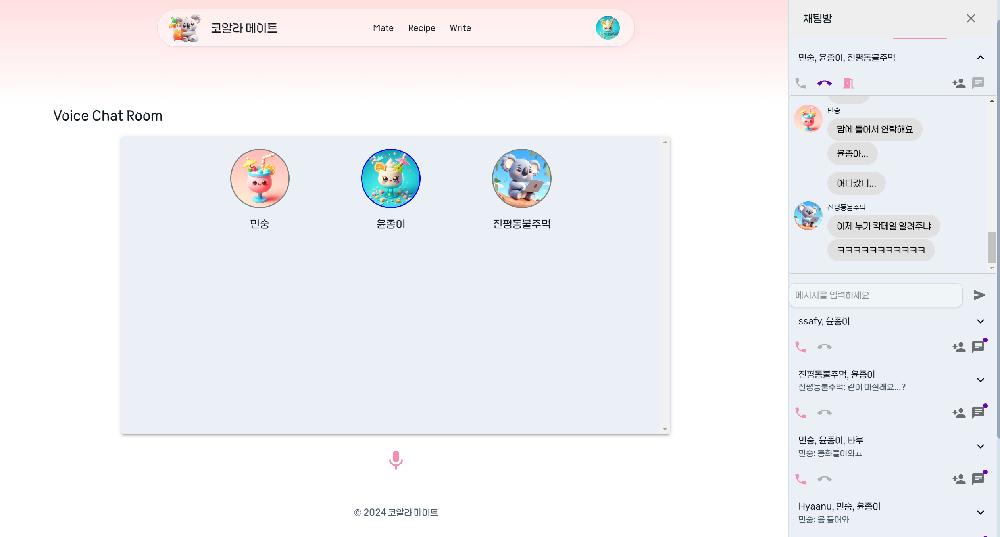
    </td>
  </tr>
</table>

<br/>

### 칵테일 레시피
<table style="border: 2px; text-align:center;">
  <tr style="text-align:center;">
    <td> 레시피 리스트 </td>
    <td> 레시피 상세보기 </td>
  </tr>
  <tr>
    <td>
      
    </td>
    <td>
      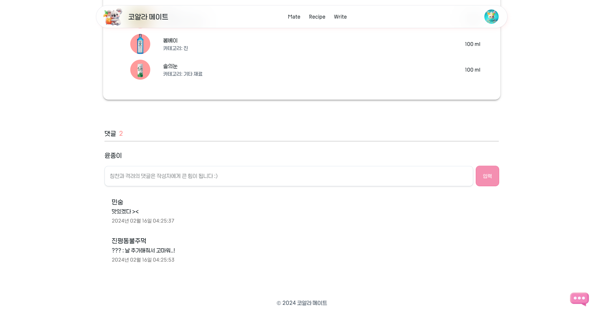
    </td>
  </tr>
</table>
<table style="border: 2px; text-align:center;">
  <tr style="text-align:center;">
    <td>레시피 작성</td>
    <td>레시피 검색</td>
  </tr>
  <tr>
    <td>
      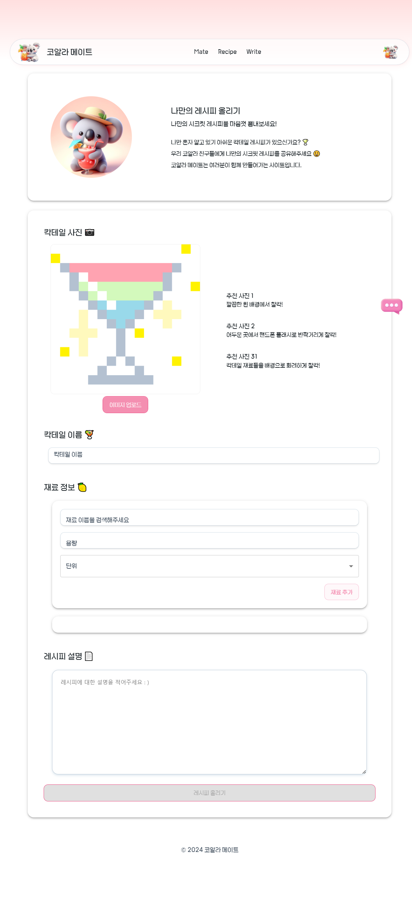
    </td>
    <td>
      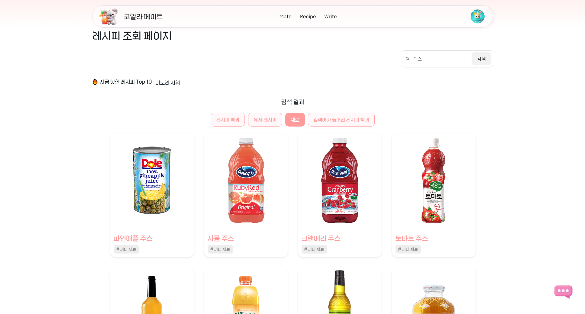
    </td>
  </tr>
</table>

<br/>

<div id="6"></div>

## 👨🏻‍💻 개발 팀 소개

<table>
<tr>
<td align="center">BE / 팀장</td>
<td align="center">BE</td>
<td align="center">BE</td>
<td align="center">FE</td>
<td align="center">FE</td>
<td align="center">FE</td>

</tr>
  <tr>
    <td align="center" width="120px">
      <a href="https://github.com/JangMinSeong" target="_blank">
        
      </a>
    </td>
    <td align="center" width="120px">
      <a href="https://github.com/LEEJUNSU11" target="_blank">
        
      </a>
    </td>
    <td align="center" width="120px">
      <a href="https://github.com/yellowchili" target="_blank">
        
      </a>
    </td>
    <td align="center" width="120px">
      <a href="https://github.com/danbeeS2" target="_blank">
        
      </a>
    </td>
    <td align="center" width="120px">
      <a href="https://github.com/Hyaanu" target="_blank">
        
      </a>
    </td>
    <td align="center" width="120px">
      <a href="https://github.com/pyunsusie" target="_blank">
        
      </a>
    </td>
  </tr>
  <tr>
    <td align="center">
      <a href="https://github.com/JangMinSeong" target="_blank">
       장민성
      </a>
    </td>
    <td align="center">
      <a href="https://github.com/LEEJUNSU11" target="_blank">
       이준수
      </a>
    </td>
    <td align="center">
      <a href="https://github.com/yellowchili" target="_blank">
       황윤정
      </a>
    </td>
    <td align="center">
      <a href="https://github.com/danbeeS2" target="_blank">
       박단비
      </a>
    </td>
    <td align="center">
      <a href="https://github.com/Hyaanu" target="_blank">
       조현우
      </a>
    </td>
    <td align="center">
      <a href="https://github.com/pyunsusie" target="_blank">
       편수지
      </a>
    </td>
  </tr>
</table>

<br />

<div id="7"></div>

## 🗓️ 개발 기간 및 일정

24.01.03. ~ 24.02.16

<br />

<div id="8"></div>

## 📂 디렉터리 구조

### Front-end

```
frontend
├───assets
├───components
│   ├───Comment
│   ├───FindMate
│   ├───Follow
│   ├───Fridge
│   ├───home
│   ├───Profile
│   │   └───Update
│   ├───RecipeBoard
│   ├───Search
│   └───WriteBoard
├───containers
├───context
├───fonts
├───hooks
├───Layout
├───pages
├───store
└───utils
```

### Back-end

```
backend
├───java
│   └───com
│       └───ssafy
│           └───koala
│               ├───config
│               │   └───jwt
│               ├───controller
│               │   ├───chat
│               │   ├───file
│               │   └───user
│               ├───dto
│               │   ├───board
│               │   ├───chat
│               │   ├───cocktail
│               │   ├───drink
│               │   ├───file
│               │   └───user
│               ├───exception
│               │   └───file
│               ├───model
│               │   ├───chat
│               │   ├───file
│               │   └───user
│               ├───repository
│               │   ├───chat
│               │   └───file
│               └───service
│                   ├───chat
│                   ├───file
│                   └───user
└───resources
```

<br />

<div id="9"></div>

## 📃 산출물

### [1. 기능 명세서](https://docs.google.com/spreadsheets/d/1iuq9lEpHl0m_5JcZyqbfA4CfmCI5HSHXRERAaSudr48/edit#gid=0)

### [2. 화면 설계서](https://www.figma.com/design/w5suP2750J6yYjBt5oPS0f/KOALA-MATE_FIGMA?t=PYu4popRF5TnRlvW-0)

### [3. API 명세서](https://hyper-revolve-e44.notion.site/API-34b1e284cfe34b1b98a311728f4e091d?pvs=4)

### [4. ERD](https://app.diagrams.net/#G1an0ozRpISSeLyQ-0E7t6eH971hvZyKIw#%7B%22pageId%22%3A%22R2lEEEUBdFMjLlhIrx00%22%7D)
